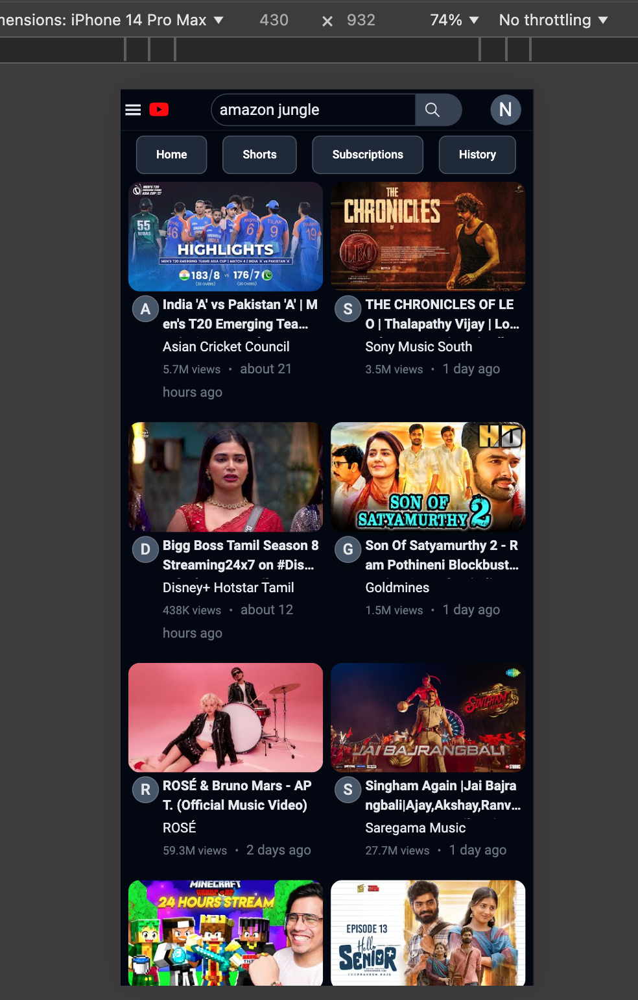

## YouTube Clone Frontend

This project is a YouTube clone built using **React**, **Redux**, and **TailwindCSS**, integrating the **YouTube v3 API** to fetch and display video data.

[**View Live Demo here**](https://ernavu.github.io/youtube/)

### Features

- **Video Search:** Users can search for videos by entering keywords into the search bar. The app leverages the Google Suggestions API to fetch relevant search results, displayed in a responsive and visually appealing layout.
  - **Debouncing:** To optimize performance, the app implements a debouncing mechanism that delays API requests until the user stops typing, preventing excessive and unnecessary calls.
  - **API Response Caching:** Search results are cached, reducing API usage for repeated queries and speeding up future searches.
  - **Search Results Display:** Clicking on a video from the search results navigates the user to a dedicated search results page showing related videos based on the query.

- **Home Page:**
  - Displays a list of the most-watched videos on YouTube, fetched via the YouTube v3 API.
  - **Video Player:** Users can click on any video card to be directed to the video player, where the selected video can be viewed.

- **Watch Page:**
  - Dedicated page for viewing a video with its details, nested comments, and live chat.
  - **Video Player:** Embeds a video player that supports full-screen mode and plays the selected video.
  - **Nested Comments:** Comments on the video are fetched from the YouTube API and displayed in a nested structure using recursion, making it easy for users to follow conversations and replies.
  - **Live Chat:** The watch page also includes a live chat component that periodically polls the YouTube Live Chat API for real-time updates, ensuring that the latest messages are displayed seamlessly.

- **State Management:** The application uses **Redux** to manage and centralize the state, ensuring smooth and scalable data flow across different components and interactions.

- **Responsive Design:** Built with **TailwindCSS**, the interface adapts seamlessly across devices, offering a consistent experience on mobile, tablet, and desktop screens.

### Technical Overview

- **React.js:** The app is built using React, a JavaScript library for creating fast, modular, and interactive user interfaces.
- **Redux:** Redux handles state management, ensuring data consistency and facilitating complex interactions between components.
- **TailwindCSS:** A utility-first CSS framework that allows for rapid development and consistent styling, directly within React components.
- **YouTube v3 API:** Used for fetching video data, search results, related videos, comments, and live chat, providing an interactive experience similar to YouTube.
- **React-Router:** Implements dynamic routing for seamless navigation between components such as the home page, search results, and watch pages.

### Screenshots

Here are a few snapshots of the app:

1. **Home Page:**
   

2. **Search Suggestions:**
   

3. **Search Results:**
   

4. **Video Player:**
   

5. **Live Chat:**
   

6. **Nested Comments:**
   

7. **Full-Screen Video Mode:**
   

8. **Responsive:**
   


### Getting Started

To run this YouTube clone locally, follow these steps:

1. **Clone the repository:**
   ```bash
   git clone https://github.com/erNavu/youtube.git
   ```

2. **Navigate to the project directory:**
   ```bash
   cd youtube
   ```

3. **Install the dependencies:**
   ```bash
   npm install
   ```

4. **Obtain a YouTube API Key:**
   - Go to the [Google Developer Console](https://console.developers.google.com/) to create a project and generate a YouTube API v3 key.

5. **Create a `.env.local` file in the root directory:**
   - Add your API key to the environment variable:
     ```bash
     REACT_APP_API_KEY=YOUR_API_KEY
     ```

6. **Start the development server:**
   ```bash
   npm run dev
   ```

7. **Access the app:**
   - Open your browser and navigate to `http://localhost:3000` to interact with the YouTube clone.
